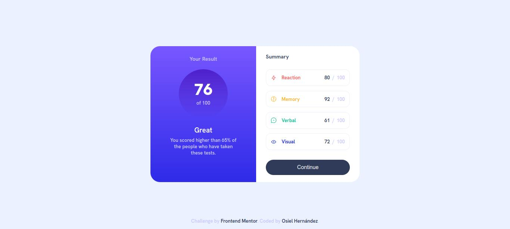

# Frontend Mentor - Results summary component solution

This is a solution to the [Results summary component challenge on Frontend Mentor](https://www.frontendmentor.io/challenges/results-summary-component-CE_K6s0maV). Frontend Mentor challenges help you improve your coding skills by building realistic projects. 

## Table of contents

- [Overview](#overview)
  - [The challenge](#the-challenge)
  - [Screenshot](#screenshot)
  - [Links](#links)
- [My process](#my-process)
  - [Built with](#built-with)
  - [What I learned](#what-i-learned)
  - [Continued development](#continued-development)
  - [Useful resources](#useful-resources)
- [Author](#author)

## Overview

### The challenge

Users should be able to:

- View the optimal layout for the interface depending on their device's screen size
- See hover and focus states for all interactive elements on the page
- **Bonus**: Use the local JSON data to dynamically populate the content

### Screenshot



### Links

- Solution URL: https://www.frontendmentor.io/solutions/results-summary-component-page-with-dynamic-results-uW59rdSsgN
- Live Site URL: https://xxosielxx.github.io/results-summary-component-challenge

## My process

### Built with

- Semantic HTML5 markup
- CSS custom properties
- Flexbox
- Mobile-first workflow

### What I learned

In this project I added the results dynamically with an object in javascript. I didn't use the data.json file provided by frontendmentor because the web browser throws me an error when I try to load that file directly from the file system. 

Also, I added classes to certain elements dynamically.

```html
<div>
  <div>Summary</div>
  <ul id="results-list"></ul>
</div>
```
```css
.red-font {
	color: var(--light-red);
}

.yellow-font {
	color: var(--orangey-yellow);
}

.green-font {
	color: var(--green-teal);
}

.blue-font {
	color: var(--cobalt-blue);
}
```
```js
const data = [
  {
    "category": "Reaction",
    "score": 80,
    "icon": "./assets/images/icon-reaction.svg",
    "color": "red-font"
  }
  // ...
]

const resultsList = document.getElementById("results-list");
    
data.forEach(item => {
  const li = document.createElement("li");
    
  li.innerHTML = `
    <div class="result-container">
      
      <span class="${item.color}">${item.category}</span>
    </div>
    <div class="text-box">
      <span class="black-font">${item.score}</span>
      <span>/</span>
      <span>100</span>
    </div>
  `;
    
  resultsList.appendChild(li);
});
```

Anyway, It was fun adding the text, images and classes of this way.

### Continued development

I would like to work with json in the future, with the aim of continuing to grow by learning new languages.

### Useful resources

- [Perplexity](https://www.perplexity.ai/) - This is a great tool for online search purposes. Thanks to this AI I have been able to find the solution to my code problems very quickly.
- [Stackoverflow](https://stackoverflow.com/) - This is an excelent way to search for solutions. In this popular website I finded solutions to my code problems many times because I'm never the first to have a specific problem appear.

## Author

- Website - [Osiel Hernández](https://xxosielxx.github.io/osez-folio)
- LinkedIn - [Osiel Hernández](https://www.linkedin.com/in/osiel-hern%C3%A1ndez-rodr%C3%ADguez-9869612a1/)
- Github - [@xXOsielXx](https://github.com/xXOsielXx)
- Frontend Mentor - [@xXOsielXx](https://www.frontendmentor.io/profile/xXOsielXx)
